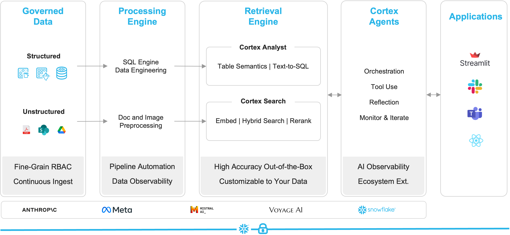
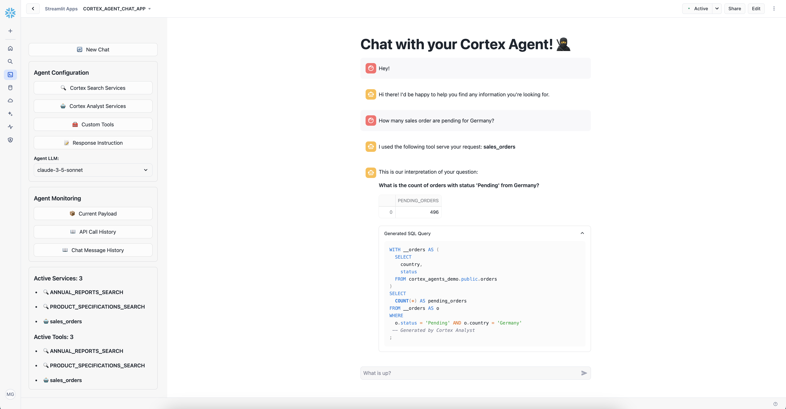

# Cortex Agents in Snowflake

## Overview
This repository provides a beginner-friendly demonstration of the power of Cortex Agents in Snowflake. 
There are multiple use cases available that you can explore in more detail in the use_cases folder.
Each use case comes with a Snowflake Notebook that guides the users through the setup of Cortex Search and Cortex Analyst Services. 
By combining multiple services, we then build a Cortex Agent capable of delivering accurate responses based on PDF documents and structured data stored across multiple Snowflake tables and documents.

## What are Cortex Agents?
Cortex Agents orchestrate both structured and unstructured data sources to deliver actionable insights. They:
- **Plan tasks**, selecting the right tools to execute them.
- **Use Cortex Analyst** for structured data (generating SQL queries).
- **Use Cortex Search** for unstructured data (extracting insights from documents and text).
- **Generate responses** using LLMs based on your enterprise data.



## Cortex Agents Workflow
Cortex Agents follow a structured approach to problem-solving:
1. **Planning:** Determine the best approach to answer a user query.
2. **Explore Options:** Resolve ambiguous queries by considering different interpretations.
3. **Split into Subtasks:** Decompose complex requests into manageable parts.
4. **Route Across Tools:** Select and utilize the right tools for the task.
5. **Tool Use:** Execute queries via Cortex Analyst and Cortex Search.
6. **Reflection:** Evaluate results, refine the process, and generate a final response.
7. **Monitor & Iterate:** Continuously improve the agent’s performance.

## Demo Features
- **End-to-End Setup:** Step-by-step instructions to configure Cortex Search and Cortex Analyst.
- **Practical Examples:** Hands-on implementation showcasing structured and unstructured data integration.
- **Agent API Usage:** Learn how to query the Cortex Agents API using REST calls from within a Streamlit App running in Snowflake.
- **Streamlit Agent App:** Configure easily which Services your Agent should use and let the Agent figure out the right approach to answer your questions.

## Demo Video
This is the App you will build:
[](https://www.youtube.com/watch?v=XwmynoLVUqw)

## Prerequisites
- A Snowflake Account
- 5 Minutes time  

Here you can get a free [Snowflake Trial Account](https://signup.snowflake.com/).

## Setup
All you need to do is to execute the following SQL statements in your Snowflake Account.  

```sql

USE ROLE ACCOUNTADMIN;

-- Create a warehouse
CREATE WAREHOUSE IF NOT EXISTS COMPUTE_WH WITH WAREHOUSE_SIZE='X-SMALL';

-- Create a fresh Database
CREATE OR REPLACE DATABASE CORTEX_AGENTS_DEMO;

-- Create the API integration with Github
CREATE OR REPLACE API INTEGRATION GITHUB_INTEGRATION_CORTEX_AGENTS_DEMO
    api_provider = git_https_api
    api_allowed_prefixes = ('https://github.com/michaelgorkow/')
    enabled = true
    comment='Git integration with Michael Gorkows Github Repository.';

-- Create the integration with the Github demo repository
CREATE GIT REPOSITORY GITHUB_REPO_CORTEX_AGENTS_DEMO
	ORIGIN = 'https://github.com/michaelgorkow/snowflake_cortex_agents_demo' 
	API_INTEGRATION = 'GITHUB_INTEGRATION_CORTEX_AGENTS_DEMO' 
	COMMENT = 'Github Repository from Michael Gorkow with a demo for Cortex Agents.';

-- Enable 2025_01 Bundle (Git-Integration for Streamlit in Snowflake)
SELECT SYSTEM$ENABLE_BEHAVIOR_CHANGE_BUNDLE('2025_01');

-- Run the installation of the Streamlit App
EXECUTE IMMEDIATE FROM @CORTEX_AGENTS_DEMO.PUBLIC.GITHUB_REPO_CORTEX_AGENTS_DEMO/branches/main/setup.sql;
```

If you want to deploy the different demo scenarios, you will need to run their setup.sql scripts in their respective folders.

**Example for the deployment of the use case Main:**
```sql
EXECUTE IMMEDIATE FROM @CORTEX_AGENTS_DEMO.PUBLIC.GITHUB_REPO_CORTEX_AGENTS_DEMO/branches/main/use_cases/main/_internal/setup.sql
  USING (BRANCH => 'main', EXECUTE_NOTEBOOKS => FALSE) DRY_RUN = FALSE;
```

If you want to run the notebook immediately to set up all the required Cortex Search and Cortex Analyst services, set `EXECUTE_NOTEBOOKS => TRUE`.  
Otherwise you will have to open the provided Snowflake Notebook and run all cells before you see the services in the Streamlit App.

| Use Case | Description | Link |
|:---:|:---:|---|
| Main | Contains a fictional dataset about customer orders and their annual reports. | [Link](https://github.com/michaelgorkow/snowflake_cortex_agents_demo/tree/main/use_cases/main) |
| SnowPrint | SnowPrint is a fictional company specializing in the sale of industrial printers. They gather data on customers, their printing jobs, and the various stages of the printing process. Additionally, they aim to integrate their product documentation into a chatbot for enhanced customer support. | [Link](https://github.com/michaelgorkow/snowflake_cortex_agents_demo/tree/main/use_cases/snowprint) |
| StayBnB | Contains a fictional dataset about a rental home company. Utilizes Multimodal LLMs to turn images into structured data. (PrPr) | [Link](https://github.com/michaelgorkow/snowflake_cortex_agents_demo/tree/main/use_cases/staybnb) |

## Objects Created in Your Snowflake Account

In your Snowflake account, the demo resources are organized as follows:

- **Database:**  
  `CORTEX_AGENTS_DEMO` is the database where all demo-related objects are stored.

- **Schemas:**  
  - The **Streamlit Agent App** is located in the `PUBLIC` schema.  
  - Each **use case** has its own schema. For example, if you install SnowPrint, a schema named `SNOWPRINT` will be created.

- **For each Use Case, the following Objects are created:**  
  - `DOCUMENTS` stage – Stores unstructured data (e.g., documents).  
  - `SEMANTIC_MODELS` stage – Contains semantic models.  
  - **Notebook** – Creates structured data and sets up Cortex Search services.

To fully grasp how the Agent works, I highly recommend reviewing the **Notebook** for each use case. These notebooks set up the services that the Agent relies on.  
In addition you should explore the semantic model in the [Snowsight Semantic Model Generator](https://docs.snowflake.com/en/user-guide/snowflake-cortex/cortex-analyst/semantic-model-spec#create-a-semantic-model-using-the-model-generator).

## Supported Models
Cortex Agents support the following LLMs depending on your region:
- `llama3.3-70b`
- `mistral-large2`
- `claude-3-5-sonnet`

## Availability
Cortex Agents are currently available in the following Snowflake regions:
- **AWS:** US West 2 (Oregon), US East 1 (Virginia), Europe Central 1 (Frankfurt), Europe West 1 (Ireland), AP Southeast 2 (Sydney), AP Northeast 1 (Tokyo)
- **Azure:** East US 2 (Virginia), West Europe (Netherlands)

For more details, check out Snowflake’s official documentation:
- [Cortex Agents](https://docs.snowflake.com/en/user-guide/snowflake-cortex/cortex-agents)
- [Cortex Search](https://docs.snowflake.com/en/user-guide/snowflake-cortex/cortex-search/cortex-search-overview)
- [Cortex Analyst](https://docs.snowflake.com/user-guide/snowflake-cortex/cortex-analyst)

## Kudos  
A huge shoutout to my colleague [Tom Christian](https://github.com/sfc-gh-tchristian) for elevating the Streamlit app to the next level! 🚀   
  
